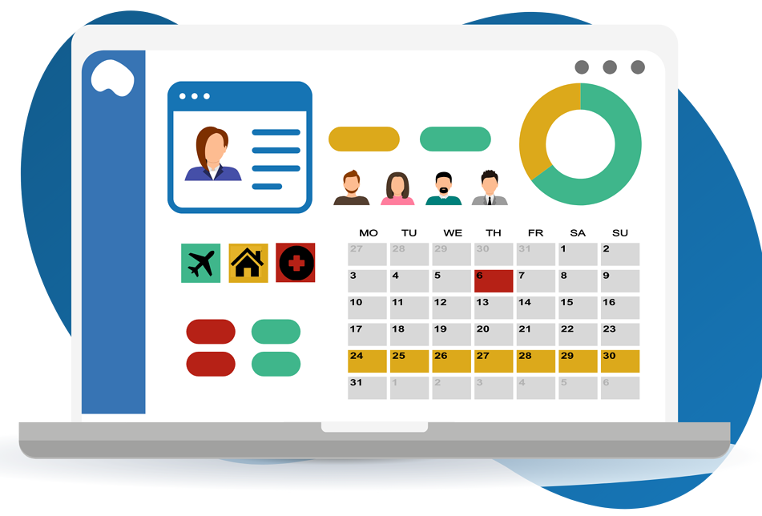

<div id="top"></div>


<!-- PROJECT SHIELDS -->

<div align="center">
     <!-- PLACEHOLDERS
     
     
     
     
     -->
</div>    


<!-- PROJECT LOGO -->
<br />
<div align="center">
    

  <h3 align="center">Vacation/Sick Days Timetracker</h3>
</div>


<!-- TABLE OF CONTENTS -->
<details>
  <summary>Table of Contents</summary>
  <ol>
    <li>
      <a href="#about-the-project">About The Project</a>
      <ul>
        <li><a href="#built-with">Built With</a></li>
      </ul>
    </li>
    <li>
      <a href="#getting-started">Getting Started</a>
      <ul>
        <li><a href="#prerequisites">Prerequisites</a></li>
      </ul>
    </li>
    <li><a href="#usage-examples">Usage Eamples</a></li>
    <li><a href="#contributing">Contributing</a></li>
    <li><a href="#license">License</a></li>
    <li><a href="#founding-contributors">Founding Contributors</a></li>
    <li><a href="#acknowledgments">Acknowledgments</a></li>
  </ol>
</details>


<!-- ABOUT THE PROJECT -->
## About The Project

<div align="center">
 
</div>

This vacation/sick days tracker allows for a small organisation to quickly alter the way vacation/sick days are requested, recorded and approved. The app focuses on letting its admin user(s) add
and remove employees' and approve their vacation days. Additional features include adding statutory holidays as well as seeing the approved vacation days of fellow employees.


### Built With

This project/app was built with the following:

* [C#](https://docs.microsoft.com/en-us/dotnet/csharp/)
* [Bootstrap](https://getbootstrap.com)
* [JQuery](https://jquery.com)
* [HTML](https://developer.mozilla.org/en-US/docs/Learn/Getting_started_with_the_web/HTML_basics)
* [.NET Core Framework](https://docs.microsoft.com/en-us/dotnet/core/tutorials/)
* [MySQL](https://www.mysql.com/)
* [Javascript](https://developer.mozilla.org/en-US/docs/Web/JavaScript)
* [FullCalendar](https://fullcalendar.io)

<p align="right">(<a href="#top">back to top</a>)</p>


<!-- GETTING STARTED -->
## Getting Started

1. Clone the repo
2. Using Visual Studio and the latest .NET Core version, open the project
3. Create a JSON file named ```app.LaunchSettings.json``
4. Inside  ```app.LaunchSettings.json``` add the following config settings:

   ```
    {
      "ConnectionStrings": {
        "Default": "Server=insert-server-name-here;Database=insert-working-database-name-here;Port=3306;UserId=admin;Password=insert-password-here; Convert Zero Datetime=True;"
      },
      "GoogleAuth": {
      "ClientId": "******************.apps.googleusercontent.com",
      "ClientSecret": "******************"
     }
    }
   ```    
   P.S. Please see our database configuration documentation.
 5. Run the solution.
    
### Prerequisites
  For our database we used MySQL, this might be optional depending on your preferences. However this web application was built with majority of the features available in .NET Core 6; we do encourage utilizing this version or the lastest. 

<p align="right">(<a href="#top">back to top</a>)</p>


<!-- USAGE EXAMPLES -->
## Usage Examples

For Administrators:
   1. Adding a request: 
      1. From the calendar UI, select the desired start date by clicking same.
      2. Upon Timeoff modal popup, populate the approperiate fields e.x. Employee, Type, Start Date, Title (if available) </br>
         
      3. Click submit
      4. A waiting modal and subsequent result modal should then appear; detailing the results of the submission. </br>
         
   2. Removing an event: 
      1. From the calendar UI, select the desired event date by clicking same.
      2. Upon event-datails modal popup, click "Remove" </br>
         
      3. On the next modal, confirm your choice by click "Confirm"
      4. A waiting modal and subsequent result modal should then appear; detailing the results of the submission. </br>
         
   3. Adding an Employee/User: 
      1. From the Employees Menu, select the "Add Employee" tab.
      2. Upon "Add Employee" modal popup, populate the required field with the employee's details </br>
         
      3. Submit the form
      4. A waiting modal and subsequent result modal should then appear; detailing the results of the submission. </br>
         

_For more examples, please refer to the [User Manual](https://github.com/jlabelle93/vacation-sick-time-tracking/blob/RTTP-62-update-read-me/user-manual.pdf)_

<p align="right">(<a href="#top">back to top</a>)</p>


<!-- ROADMAP -->
## Roadmap
- [X] Setup and Configure EC Instance and Database Connection
- [X] Add Calendar Functionality
    - [X] Setup and configure the JS Calendar
    - [X] Apply the required modification to the calendar
    - [X] Configure Calendar to display data from database
    - [X] Make Calender display icons for start/end Dates
    - [X] Add click events functionality i.e. Add timeoff, dropdown menus etc.
 - [X] Create User Sign-In page
    - [X] Configure Google OAuth/Sign In
    - [X] Grant Access for authorised accounts
    - [X] Create redirect for unauthorised accounts
 - [X] Develop Admin functionality
    - [X] Ability to add and approve new vacation requests
    - [X] Ability to delete vacation/sick days
    - [X] Ability to generate reports
 - [X] Develop logout functionality
    - [X] Log user out of web app
   

<p align="right">(<a href="#top">back to top</a>)</p>


<!-- CONTRIBUTING -->
## Contributing

Contributions are what make the open source community such an amazing place to learn, inspire, and create. Any contributions you make are **greatly appreciated**.

If you have a suggestion that would make this better, please fork the repo and create a pull request. You can also simply open an issue with the tag "enhancement".
Don't forget to give the project a star! Thanks again!

1. Fork the Project
2. Create your Feature Branch (`git checkout -b branch-name`)
3. Commit your Changes (`git commit -m 'Add some AmazingFeature'`)
4. Push to the Branch (`git push origin branch-name`)
5. Open a Pull Request again current Sprint branch

<p align="right">(<a href="#top">back to top</a>)</p>


<!-- LICENSE -->
## License

Distributed under the MIT License. See [LICENSE.md](https://github.com/jlabelle93/vacation-sick-time-tracking/blob/RTTP-62-update-read-me/LICENSE) for more information.

<p align="right">(<a href="#top">back to top</a>)</p>


<!-- CONTACT -->
## Founding Contributors

1. André Bertram - abertram.ca@gmail.com
2. Jacob Labelle - jacob.labelle93@gmail.com
3. Devon Volberg - johnnyanddukeytest@gmail.com
4. Dermot Johnson - dermotjohnson1@gmail.com

<p align="right">(<a href="#top">back to top</a>)</p>

<!--
## DISCLAIMER
*** This readMe template was forked from the Best-README-Template. Please see our acknowledgement to these creative contributors.
*** All credit goes to its repective contributors/creators.
-->


<!-- ACKNOWLEDGMENTS -->
## Acknowledgments
* [Best-README-Template ](https://github.com/othneildrew/Best-README-Template/blob/master/README.md)
* [Colorlib](https://colorlib.com/wp/template/colorlib-error-404-9/)
* [Ivan Grozdic](https://codepen.io/ig_design/pen/KKVQpVP)
* [Andrew](https://codepen.io/theawesomecoder61/pen/KKEpbv)
* [bestjquery.com](http://bestjquery.com/tutorial/table-style/demo5/)

<p align="right">(<a href="#top">back to top</a>)</p>


<!-- MARKDOWN LINKS & IMAGES -->
<!-- https://www.markdownguide.org/basic-syntax/#reference-style-links -->
[contributors-shield]: https://img.shields.io/github/contributors/othneildrew/Best-README-Template.svg?style=for-the-badge
[contributors-url]: https://github.com/jlabelle93/vacation-sick-time-tracking/graphs/contributors
[forks-shield]: https://img.shields.io/github/forks/othneildrew/Best-README-Template.svg?style=for-the-badge
[forks-url]: https://github.com/jlabelle93/vacation-sick-time-tracking/network/members
[stars-shield]: https://img.shields.io/github/stars/othneildrew/Best-README-Template.svg?style=for-the-badge
[stars-url]: https://github.com/othneildrew/Best-README-Template/stargazers
[issues-shield]: https://img.shields.io/github/issues/othneildrew/Best-README-Template.svg?style=for-the-badge
[issues-url]: https://github.com/jlabelle93/vacation-sick-time-tracking/issues
[license-shield]: https://img.shields.io/github/license/othneildrew/Best-README-Template.svg?style=for-the-badge
[linkedin-shield]: https://img.shields.io/badge/-LinkedIn-black.svg?style=for-the-badge&logo=linkedin&colorB=555
[linkedin-url]: https://linkedin.com/in/
[product-screenshot]: repo_images/app.png
